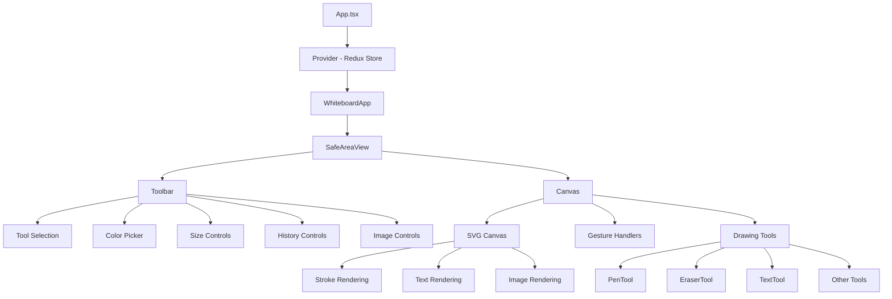
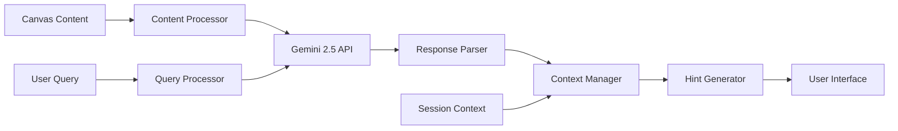
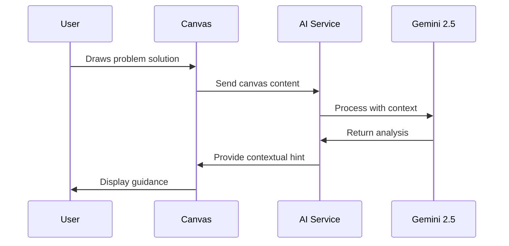
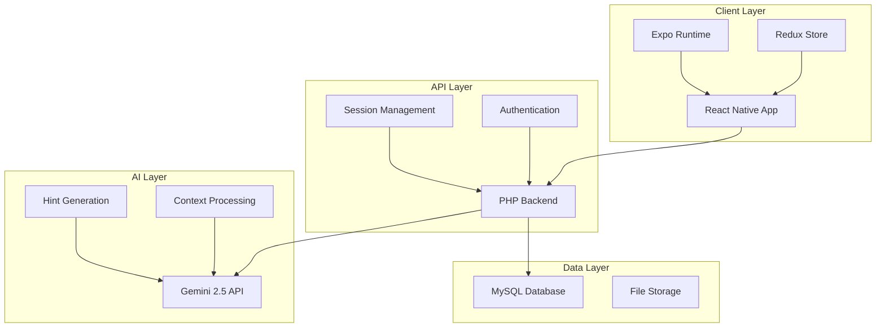
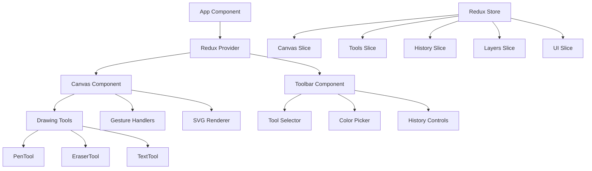
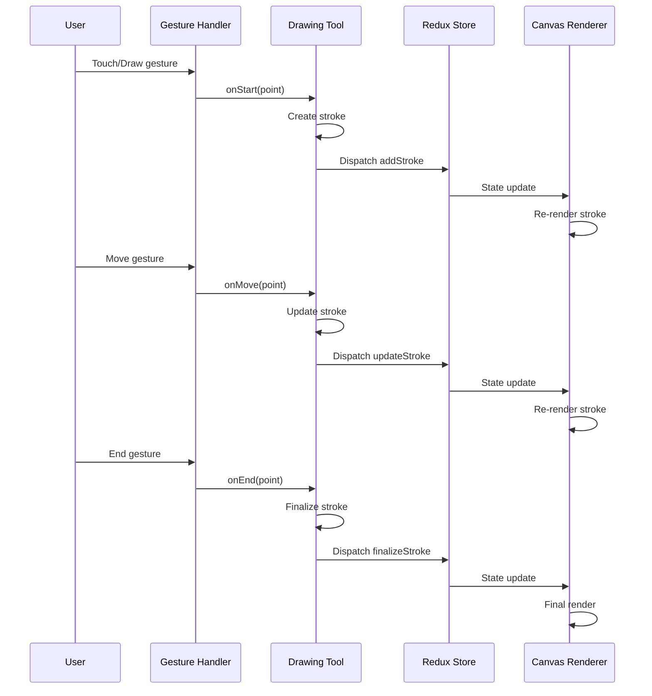
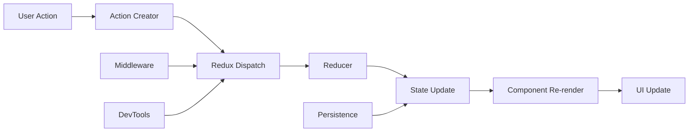
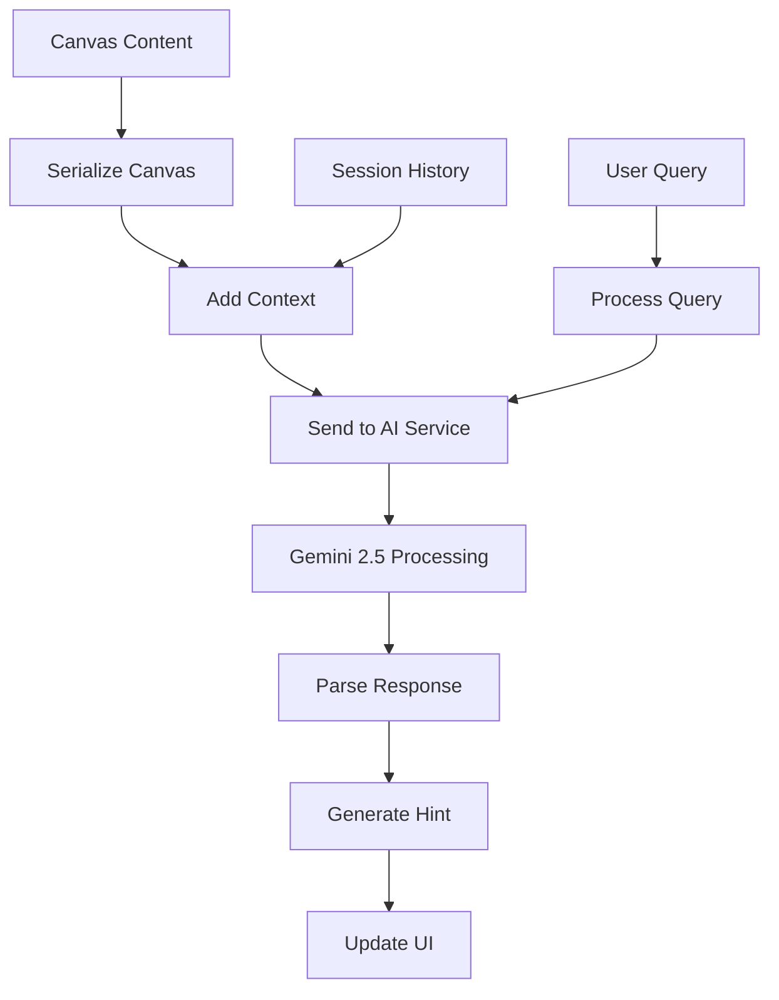

# System Architecture

## Table of Contents

- [Overview](#overview)
- [Frontend Architecture](#frontend-architecture)
- [Backend Architecture (Planned)](#backend-architecture-planned)
- [AI Integration](#ai-integration)
- [System Diagrams](#system-diagrams)
- [Data Flow](#data-flow)
- [Performance Considerations](#performance-considerations)
- [Security Considerations](#security-considerations)

---

## Overview

SL8.ai follows a modern mobile-first architecture with a React Native frontend, planned PHP backend, and AI integration through Gemini 2.5. The system is designed to provide an intelligent tutoring experience for algorithmic thinking, where students can draw their problem-solving process and receive contextual guidance without direct solutions.

The architecture emphasizes:
- **Cross-platform compatibility** through React Native/Expo
- **Scalable state management** with Redux Toolkit
- **Modular drawing tools** with extensible tool system
- **Intelligent AI integration** for contextual learning assistance
- **Offline-first approach** with cloud synchronization capabilities

[↑ Back to top](#table-of-contents)

## Frontend Architecture

### React Native/Expo Structure

The frontend is built using React Native with Expo, providing cross-platform mobile development with native performance. The application structure follows a modular approach:

```
SL8WhiteboardExpo/
├── App.tsx                 # Root application component
├── src/
│   ├── components/         # Reusable UI components
│   │   ├── Canvas.tsx      # Main drawing canvas
│   │   ├── Toolbar.tsx     # Tool selection and controls
│   │   ├── CameraButton.tsx
│   │   └── ImagePickerButton.tsx
│   ├── store/              # Redux store and state management
│   │   ├── index.ts        # Store configuration
│   │   ├── selectors.ts    # State selectors
│   │   └── slices/         # Redux Toolkit slices
│   ├── tools/              # Drawing tool implementations
│   │   ├── BaseTool.ts     # Abstract base class
│   │   ├── PenTool.ts      # Pen drawing tool
│   │   ├── PencilTool.ts   # Pencil drawing tool
│   │   ├── HighlighterTool.ts
│   │   ├── EraserTool.ts   # Smart eraser with stroke splitting
│   │   └── TextTool.ts     # Text annotation tool
│   ├── hooks/              # Custom React hooks
│   │   └── useHistory.ts   # Undo/redo functionality
│   ├── types/              # TypeScript type definitions
│   │   └── index.ts        # Core data types
│   └── utils/              # Utility functions
│       ├── imageUtils.ts   # Image processing utilities
│       └── index.ts
└── package.json
```

#### Key Technologies:
- **React Native 0.79.5**: Core framework for mobile development
- **Expo ~53.0.20**: Development platform and build tools
- **React Native SVG**: Vector graphics rendering for drawing
- **React Native Gesture Handler**: Advanced gesture recognition
- **React Native Reanimated**: High-performance animations

### Redux Toolkit State Management

The application uses Redux Toolkit for predictable state management with five main slices:

#### 1. Canvas Slice (`canvasSlice.ts`)
Manages the drawing canvas state and content:

```typescript
interface CanvasState {
  size: CanvasSize;              // Canvas dimensions (4x screen size)
  zoom: number;                  // Current zoom level (0.25x - 4.0x)
  panOffset: { x: number; y: number }; // Pan position
  strokes: Record<string, Stroke>;     // All drawing strokes
  textElements: Record<string, TextElement>; // Text annotations
  imageElements: Record<string, ImageElement>; // Pasted/imported images
  selectedImageId: string | null;      // Currently selected image
}
```

**Key Actions:**
- `setCanvasSize`, `setZoom`, `setPanOffset` - Viewport management
- `addStroke`, `updateStroke`, `removeStroke` - Drawing operations
- `addTextElement`, `addImageElement` - Content management
- `clearCanvas`, `resetView` - Canvas operations

#### 2. Tools Slice (`toolsSlice.ts`)
Manages drawing tools and their settings:

```typescript
interface ToolsState {
  currentTool: Tool;           // Active drawing tool
  toolHistory: Tool[];         // Recently used tools
  colorPalette: string[];      // Available colors
  customColors: string[];      // User-defined colors
}
```

**Supported Tools:**
- **Pen**: Smooth drawing with customizable stroke properties
- **Pencil**: Textured drawing with natural feel
- **Highlighter**: Semi-transparent overlay drawing
- **Eraser**: Smart eraser that splits strokes instead of removing entirely
- **Text**: Direct text annotation on canvas

#### 3. Layers Slice (`layersSlice.ts`)
Manages drawing layers for organization:

```typescript
interface LayersState {
  layers: Record<string, Layer>;  // All layers
  activeLayerId: string;          // Currently active layer
  layerOrder: string[];           // Layer z-order
}
```

**Layer Features:**
- Visibility toggle
- Opacity control
- Lock/unlock for editing protection
- Reordering capabilities
- Element association (strokes, text, images)

#### 4. History Slice (`historySlice.ts`)
Implements undo/redo functionality:

```typescript
interface HistoryState {
  entries: HistoryEntry[];     // Action history
  currentIndex: number;        // Current position in history
  maxEntries: number;          // History size limit
}
```

#### 5. UI Slice (`uiSlice.ts`)
Manages user interface state and preferences.

### Component Hierarchy



### Drawing Tools System

The drawing system follows an object-oriented architecture with a base class and specialized implementations:

#### BaseTool Abstract Class
```typescript
abstract class BaseTool {
  protected settings: ToolSettings;
  protected isActive: boolean;
  protected currentStroke: Stroke | null;
  
  abstract onStart(point: Point, layerId: string): void;
  abstract onMove(point: Point): void;
  abstract onEnd(point: Point): Stroke | null;
}
```

#### Tool Implementations

**PenTool**: Smooth vector drawing with pressure sensitivity support
- Implements point smoothing algorithms
- Supports customizable stroke properties
- Real-time stroke preview

**EraserTool**: Intelligent erasing with stroke splitting
- Collision detection with existing strokes
- Splits strokes instead of complete removal
- Preserves drawing integrity

**TextTool**: Direct text annotation
- Click-to-type functionality
- Customizable text styling
- Inline editing capabilities

#### Tool Extension Pattern
New tools can be easily added by:
1. Extending `BaseTool` class
2. Implementing required abstract methods
3. Adding tool type to `ToolType` union
4. Registering in tool factory

[↑ Back to top](#table-of-contents)

## Backend Architecture (Planned)

### PHP + MySQL Structure

The backend will follow a modern PHP architecture with the following structure:

```
backend/
├── public/
│   └── index.php           # Entry point
├── src/
│   ├── Controllers/        # API controllers
│   │   ├── AuthController.php
│   │   ├── SessionController.php
│   │   └── AIController.php
│   ├── Models/             # Data models
│   │   ├── User.php
│   │   ├── Session.php
│   │   └── Canvas.php
│   ├── Services/           # Business logic
│   │   ├── AuthService.php
│   │   ├── CanvasService.php
│   │   └── AIService.php
│   ├── Middleware/         # Request middleware
│   └── Database/           # Database migrations and seeds
├── config/                 # Configuration files
└── composer.json
```

#### Technology Stack:
- **PHP 8.1+**: Modern PHP with type declarations
- **MySQL 8.0**: Relational database for structured data
- **Composer**: Dependency management
- **JWT**: Authentication tokens
- **RESTful API**: Standard HTTP API design

### Database Design

```sql
-- Users table
CREATE TABLE users (
    id INT PRIMARY KEY AUTO_INCREMENT,
    email VARCHAR(255) UNIQUE NOT NULL,
    password_hash VARCHAR(255) NOT NULL,
    name VARCHAR(255) NOT NULL,
    created_at TIMESTAMP DEFAULT CURRENT_TIMESTAMP,
    updated_at TIMESTAMP DEFAULT CURRENT_TIMESTAMP ON UPDATE CURRENT_TIMESTAMP
);

-- Canvas sessions
CREATE TABLE canvas_sessions (
    id INT PRIMARY KEY AUTO_INCREMENT,
    user_id INT NOT NULL,
    title VARCHAR(255) NOT NULL,
    canvas_data JSON NOT NULL,
    ai_context JSON,
    created_at TIMESTAMP DEFAULT CURRENT_TIMESTAMP,
    updated_at TIMESTAMP DEFAULT CURRENT_TIMESTAMP ON UPDATE CURRENT_TIMESTAMP,
    FOREIGN KEY (user_id) REFERENCES users(id) ON DELETE CASCADE
);

-- AI interactions
CREATE TABLE ai_interactions (
    id INT PRIMARY KEY AUTO_INCREMENT,
    session_id INT NOT NULL,
    interaction_type ENUM('analysis', 'hint', 'feedback') NOT NULL,
    user_input JSON,
    ai_response JSON,
    created_at TIMESTAMP DEFAULT CURRENT_TIMESTAMP,
    FOREIGN KEY (session_id) REFERENCES canvas_sessions(id) ON DELETE CASCADE
);
```

### API Structure

#### Authentication Endpoints
- `POST /api/auth/register` - User registration
- `POST /api/auth/login` - User login
- `POST /api/auth/logout` - User logout
- `GET /api/auth/me` - Get current user

#### Canvas Session Endpoints
- `GET /api/sessions` - List user sessions
- `POST /api/sessions` - Create new session
- `GET /api/sessions/{id}` - Get session details
- `PUT /api/sessions/{id}` - Update session
- `DELETE /api/sessions/{id}` - Delete session

#### AI Integration Endpoints
- `POST /api/ai/analyze` - Analyze canvas content
- `POST /api/ai/hint` - Request contextual hint
- `POST /api/ai/feedback` - Get feedback on solution

## AI Integration

### Gemini 2.5 Integration Architecture

The AI integration follows a service-oriented architecture that processes canvas content and provides contextual educational guidance:



#### AI Service Components:

**Content Processor**:
- Converts canvas strokes to structured data
- Extracts text and image content
- Identifies drawing patterns and structures

**Context Manager**:
- Maintains conversation history
- Tracks problem-solving progress
- Manages educational context

**Hint Generator**:
- Generates contextual hints without giving solutions
- Adapts to student's current understanding level
- Provides step-by-step guidance

### Analysis and Hint System

The AI system implements a six-level help system:

1. **"I am stuck"** - General encouragement and direction
2. **"I need a hint"** - Specific guidance on next steps
3. **"Show me an example"** - Related problem examples
4. **"Explain this concept"** - Theoretical background
5. **"Check my work"** - Solution validation
6. **"What's wrong?"** - Error identification and correction

#### AI Interaction Flow:


## System Diagrams

### High-Level Architecture



### Component Relationships



## Data Flow

### Drawing Operation Flow



### State Management Flow



### AI Integration Flow



## Performance Considerations

### Frontend Optimizations
- **Canvas Virtualization**: Only render visible strokes
- **Gesture Debouncing**: Optimize touch event handling
- **Memory Management**: Efficient stroke storage and cleanup
- **Lazy Loading**: Load tools and components on demand

### State Management Optimizations
- **Normalized State**: Flat state structure for performance
- **Memoized Selectors**: Prevent unnecessary re-renders
- **Action Batching**: Group related state updates
- **Middleware Optimization**: Efficient action processing

### Drawing Performance
- **SVG Optimization**: Efficient path rendering
- **Stroke Simplification**: Reduce point density for large strokes
- **Layer Management**: Optimize layer rendering order
- **Caching**: Cache rendered elements when possible

## Security Considerations

### Frontend Security
- **Input Validation**: Sanitize all user inputs
- **XSS Prevention**: Secure text rendering
- **File Upload Security**: Validate image uploads
- **Token Management**: Secure JWT storage

### Backend Security
- **Authentication**: JWT-based authentication
- **Authorization**: Role-based access control
- **SQL Injection Prevention**: Parameterized queries
- **Rate Limiting**: API request throttling
- **CORS Configuration**: Proper cross-origin setup

### AI Integration Security
- **API Key Management**: Secure Gemini API credentials
- **Content Filtering**: Validate AI responses
- **Privacy Protection**: Anonymize user data
- **Usage Monitoring**: Track AI service usage

---

## Related Documentation

📋 **Documentation Hub**: [Main Documentation](README.md)  
⚙️ **Installation**: [Installation Guide](INSTALLATION.md)  
🔌 **API Reference**: [API Documentation](API.md)  
👨‍💻 **Development**: [Development Guide](DEVELOPMENT.md)  
🗺️ **Roadmap**: [Feature Roadmap](ROADMAP.md)  
📖 **Use Cases**: [Use Cases & Workflows](USE_CASES.md)  
🤔 **Technical Decisions**: [Technical Decisions](TECHNICAL_DECISIONS.md)

[↑ Back to top](#table-of-contents)