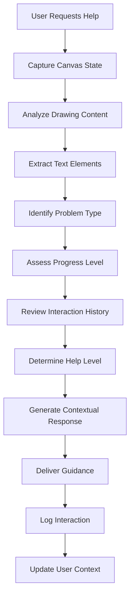
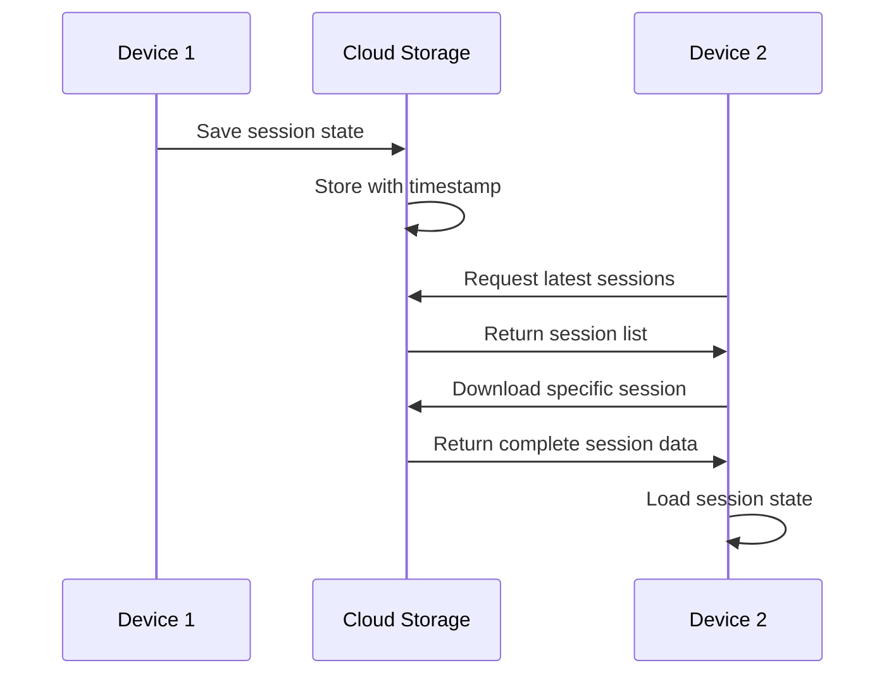
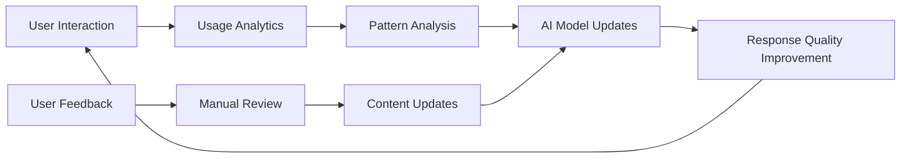

# Use Cases and User Workflows

## Navigation

📋 **Documentation Hub**: [Main Documentation](README.md)  
🏗️ **Architecture**: [System Architecture](ARCHITECTURE.md)  
⚙️ **Installation**: [Installation Guide](INSTALLATION.md)  
🔌 **API Reference**: [API Documentation](API.md)  
👨‍💻 **Development**: [Development Guide](DEVELOPMENT.md)  
🗺️ **Roadmap**: [Feature Roadmap](ROADMAP.md)  
🤔 **Technical Decisions**: [Technical Decisions](TECHNICAL_DECISIONS.md)

---

## Table of Contents

- [Overview](#overview)
- [Primary User Journey: Student Solving Algorithmic Problems](#primary-user-journey-student-solving-algorithmic-problems)
- [Six-Level Help System](#six-level-help-system)
- [AI Interaction Patterns and Step-by-Step Guidance Flow](#ai-interaction-patterns-and-step-by-step-guidance-flow)
- [Session Persistence and Recovery Workflows](#session-persistence-and-recovery-workflows)
- [Error Scenarios and Exception Handling](#error-scenarios-and-exception-handling)

---

## Overview

This document describes the primary use cases and user workflows for SL8.ai, an intelligent whiteboard designed for algorithmic thinking. The platform serves as an AI-powered tutor that guides users through problem-solving processes without providing direct solutions, fostering critical thinking and deep understanding of algorithmic concepts.

## Primary User Journey: Student Solving Algorithmic Problems

### Scenario: Computer Science Student Working on Binary Search Implementation

**User Profile**: Sarah, a second-year CS student preparing for technical interviews, needs to understand and implement binary search algorithm.

#### Phase 1: Problem Setup and Initial Exploration

**1. Session Creation**
- Sarah opens SL8.ai and creates a new canvas session
- She titles it "Binary Search Algorithm Practice"
- The system initializes a clean canvas with default drawing tools available

**User Actions**:
```
1. Tap "New Session" button
2. Enter session title: "Binary Search Algorithm Practice"
3. Select problem type: "Algorithm"
4. Set difficulty level: "Medium"
5. Add tags: ["binary-search", "arrays", "divide-conquer"]
```

**System Response**:
- Creates new session with unique ID
- Initializes canvas with 4x screen size (4096x3072 default)
- Sets up Redux state with empty strokes, text elements, and image elements
- Activates pen tool as default
- Saves session metadata to local storage

**2. Problem Statement Input**
- Sarah uses the text tool to write the problem statement
- She sketches an example array: `[1, 3, 5, 7, 9, 11, 13, 15]`
- She notes the target value: `target = 7`

**User Actions**:
```
1. Select text tool from toolbar
2. Tap on canvas to create text element
3. Type: "Find target value 7 in sorted array [1,3,5,7,9,11,13,15]"
4. Switch to pen tool
5. Draw array visualization with indices
```

**System Response**:
- Creates text element with timestamp and position
- Stores text content in Redux state
- Renders text on canvas with specified styling
- Switches active tool to pen
- Tracks drawing strokes as user sketches array

#### Phase 2: Initial Problem-Solving Attempt

**3. First Implementation Attempt**
- Sarah starts drawing her approach using pen tool
- She draws pointers for `left = 0` and `right = 7`
- She begins sketching the algorithm logic

**User Actions**:
```
1. Draw left pointer at index 0
2. Draw right pointer at index 7
3. Calculate middle: mid = (0 + 7) / 2 = 3
4. Draw arrow pointing to array[3] = 7
5. Write: "Found target!"
```

**System Response**:
- Records each stroke with points, timestamps, and styling
- Calculates bounding boxes for drawn elements
- Updates canvas state in real-time
- Maintains drawing history for undo/redo functionality

**4. Realization of Incomplete Understanding**
- Sarah realizes she solved it too quickly by luck
- She wants to understand the general case
- She decides to try a different target value

**User Actions**:
```
1. Use eraser tool to remove "Found target!" text
2. Change target value to 6 (not in array)
3. Start redrawing the algorithm steps
```

**System Response**:
- Eraser tool splits strokes instead of complete removal
- Updates stroke collection by removing intersected portions
- Maintains canvas integrity and drawing quality

#### Phase 3: Getting Stuck and Requesting Help

**5. Encountering Difficulty**
- Sarah gets confused about the termination condition
- She's not sure when to stop the loop
- She decides to ask for AI assistance

**User Actions**:
```
1. Tap "AI Help" button in toolbar
2. Select help level: "I am stuck" (Level 1)
3. Optional: Add context message: "I'm confused about when to stop the binary search loop"
```

**System Response**:
- Captures current canvas state (strokes, text, images)
- Serializes canvas data for AI analysis
- Sends request to AI service with user context
- Displays loading indicator while processing

**6. AI Analysis and Initial Guidance**
- The AI analyzes Sarah's drawing and provides Level 1 help
- Encouragement without revealing the solution

**AI Response (Level 1 - "I am stuck")**:
```json
{
  "type": "encouragement",
  "message": "I can see you're working on binary search - great choice for learning divide-and-conquer! You've correctly identified the need for left and right pointers. The key insight you're looking for involves understanding what happens to your search space with each iteration.",
  "guidance": "Take a step back and think about what binary search is trying to accomplish. What does it mean when you can't find the target?",
  "nextSteps": "Try working through a case where the target isn't in the array. What should happen to your left and right pointers?"
}
```

**System Response**:
- Displays AI message in a non-intrusive overlay
- Logs interaction in session history
- Updates AI interaction counter
- Maintains canvas focus for continued work

#### Phase 4: Progressive Help System

**7. Requesting More Specific Help**
- Sarah tries again but still struggles
- She requests a more specific hint

**User Actions**:
```
1. Continue working for 2-3 minutes
2. Tap "AI Help" again
3. Select help level: "I need a hint" (Level 2)
4. Add context: "I understand the pointers but not sure about the loop condition"
```

**AI Response (Level 2 - "I need a hint")**:
```json
{
  "type": "guiding_question",
  "message": "Good question! Let's think about this step by step. In binary search, what happens to the distance between left and right with each iteration?",
  "hint": "Consider this: if left becomes greater than right, what does that tell you about the search space?",
  "conceptualGuidance": "The loop should continue as long as there's still a valid search space. When is the search space empty?"
}
```

**8. Continued Struggle - Requesting Example**
- Sarah understands the concept better but wants to see it in action

**User Actions**:
```
1. Work through the hint for 5 minutes
2. Make some progress but still uncertain
3. Request help level: "Show me an example" (Level 3)
```

**AI Response (Level 3 - "Show me an example")**:
```json
{
  "type": "guided_example",
  "message": "Let's trace through an example together. I'll guide you through the steps without giving away the implementation.",
  "example": {
    "array": "[1, 3, 5, 7, 9]",
    "target": "6",
    "steps": [
      "Start: left=0, right=4, search space has 5 elements",
      "Step 1: mid=2, array[2]=5, 5<6, so search right half",
      "Step 2: left=3, right=4, search space has 2 elements", 
      "Step 3: mid=3, array[3]=7, 7>6, so search left half",
      "Step 4: left=3, right=2, left>right - what does this mean?"
    ]
  },
  "question": "In Step 4, left became greater than right. What should happen now?"
}
```

#### Phase 5: Understanding and Implementation

**9. Breakthrough Moment**
- Sarah understands that `left > right` means the element isn't found
- She implements the complete algorithm

**User Actions**:
```
1. Use pen tool to write: "while (left <= right)"
2. Draw the complete algorithm flow
3. Add termination condition: "if left > right, return -1"
4. Test with the example from AI guidance
```

**System Response**:
- Records all drawing actions with timestamps
- Maintains stroke history for potential undo operations
- Updates canvas state with new elements
- Prepares for potential AI validation request

**10. Solution Validation**
- Sarah wants to verify her understanding is correct

**User Actions**:
```
1. Request help level: "Check my work" (Level 5)
2. Add context: "I think I understand now - can you verify my solution?"
```

**AI Response (Level 5 - "Check my work")**:
```json
{
  "type": "validation",
  "message": "Excellent work! You've correctly identified the key components of binary search.",
  "validation": {
    "correct_elements": [
      "Proper initialization of left and right pointers",
      "Correct loop condition: while (left <= right)",
      "Proper midpoint calculation",
      "Correct termination condition for element not found"
    ],
    "suggestions": [
      "Consider edge cases: what happens with an empty array?",
      "Think about integer overflow in midpoint calculation for very large arrays"
    ]
  },
  "encouragement": "You've demonstrated solid understanding of the algorithm's logic. The step-by-step reasoning you showed is exactly the kind of thinking that will serve you well in technical interviews!"
}
```

#### Phase 6: Session Completion and Persistence

**11. Session Wrap-up**
- Sarah feels confident about her understanding
- She saves her work and adds final notes

**User Actions**:
```
1. Add text element: "Key insight: left > right means search space is empty"
2. Use highlighter to emphasize important parts
3. Tap "Save Session" 
4. Add completion notes: "Understood termination condition and edge cases"
```

**System Response**:
- Serializes complete canvas state to JSON
- Saves session data to local storage
- Updates session metadata with completion status
- Stores AI interaction history
- Generates session summary with key insights

## Six-Level Help System

The AI assistance system provides progressive help through six distinct levels, each designed to provide appropriate guidance without revealing solutions directly.

### Level 1: "I am stuck" - General Encouragement and Direction

**Purpose**: Provide emotional support and general direction without specific hints
**Timing**: When user first requests help or feels overwhelmed
**AI Behavior**: 
- Acknowledges user's current progress
- Provides encouragement and confidence building
- Offers general direction without specific solutions
- Asks broad, thought-provoking questions

**Example Responses**:
```
"I can see you're making good progress on this algorithm! You've identified the key components. Sometimes when we feel stuck, it helps to step back and think about the bigger picture. What is this algorithm trying to accomplish?"

"You're on the right track! The approach you're taking shows good algorithmic thinking. When you feel stuck, try asking yourself: what would happen if I traced through this step by step with a simple example?"
```

**User Experience**:
- Feels supported and encouraged
- Gains confidence to continue working
- Receives gentle nudge toward productive thinking
- No specific technical details revealed

### Level 2: "I need a hint" - Specific Guidance on Next Steps

**Purpose**: Provide targeted hints about the immediate next step
**Timing**: When user has made some progress but needs direction
**AI Behavior**:
- Analyzes current canvas content for context
- Identifies the specific area where user is stuck
- Provides focused hint about the next logical step
- Uses guiding questions to promote discovery

**Example Responses**:
```
"Looking at your drawing, I can see you understand the basic structure. The key insight you're looking for involves the relationship between your left and right pointers. What happens to the search space with each iteration?"

"You've correctly identified the need for a loop. Now think about this: under what condition should the loop continue? What does it mean when there's no more space to search?"
```

**User Experience**:
- Receives specific direction without solution
- Understands what to focus on next
- Maintains ownership of problem-solving process
- Feels guided but not given answers

### Level 3: "Show me an example" - Related Problem Examples

**Purpose**: Demonstrate concepts through guided examples
**Timing**: When user understands hints but needs to see application
**AI Behavior**:
- Provides step-by-step walkthrough of similar problem
- Uses different data than user's current problem
- Explains reasoning at each step
- Connects example back to user's specific case

**Example Responses**:
```
"Let's trace through a similar example together. Consider the array [2, 4, 6, 8, 10] and we're looking for 7:

Step 1: left=0, right=4, mid=2, array[2]=6
Since 6 < 7, we search the right half...

Step 2: left=3, right=4, mid=3, array[3]=8  
Since 8 > 7, we search the left half...

Step 3: left=3, right=2
Notice that left > right now. What does this tell us?"
```

**User Experience**:
- Sees concept applied in concrete example
- Understands the step-by-step reasoning
- Can apply similar logic to their own problem
- Gains confidence through guided demonstration

### Level 4: "Explain this concept" - Theoretical Background

**Purpose**: Provide deeper conceptual understanding
**Timing**: When user needs theoretical foundation
**AI Behavior**:
- Explains underlying principles and theory
- Connects current problem to broader concepts
- Provides context about why approach works
- Relates to real-world applications

**Example Responses**:
```
"Binary search is based on the divide-and-conquer principle. The key insight is that by comparing with the middle element, we can eliminate half of the remaining search space with each comparison.

This works because the array is sorted - if the target is smaller than the middle element, it can only be in the left half. This logarithmic reduction is why binary search is O(log n) instead of O(n) for linear search.

The termination condition (left > right) represents the mathematical concept of an empty search space - when there are no more elements to examine."
```

**User Experience**:
- Gains deeper understanding of underlying principles
- Connects current problem to broader computer science concepts
- Understands the "why" behind the approach
- Builds foundation for tackling similar problems

### Level 5: "Check my work" - Solution Validation

**Purpose**: Validate user's solution and provide feedback
**Timing**: When user believes they have a complete solution
**AI Behavior**:
- Analyzes user's complete solution
- Identifies correct and incorrect elements
- Provides specific feedback on implementation
- Suggests improvements or edge cases to consider

**Example Responses**:
```
"Great work! Let me review your solution:

✅ Correct: Your loop condition 'while (left <= right)' is perfect
✅ Correct: Midpoint calculation and comparison logic
✅ Correct: Updating left and right pointers appropriately
✅ Correct: Returning -1 when element not found

💡 Consider: What happens with integer overflow in (left + right) / 2 for very large arrays? The expression left + (right - left) / 2 is safer.

💡 Edge case: Your solution handles empty arrays correctly by immediately returning -1."
```

**User Experience**:
- Receives validation of correct understanding
- Learns about edge cases and optimizations
- Gains confidence in solution quality
- Understands areas for improvement

### Level 6: "What's wrong?" - Error Identification and Correction

**Purpose**: Help identify and fix specific errors
**Timing**: When user's solution has bugs or logical errors
**AI Behavior**:
- Identifies specific errors in logic or implementation
- Explains why the error occurs
- Guides toward correct solution without giving it directly
- Helps develop debugging skills

**Example Responses**:
```
"I notice an issue in your loop condition. You wrote 'while (left < right)' but this will miss the case where the target is at the position where left equals right.

Think about it: if left = right = 3, and array[3] is your target, your current condition would skip checking that position.

Try tracing through your algorithm with the array [5] and target 5. What happens with your current condition versus 'while (left <= right)'?"
```

**User Experience**:
- Learns to identify and fix bugs systematically
- Understands the reasoning behind corrections
- Develops debugging and testing mindset
- Maintains problem-solving ownership

[↑ Back to top](#table-of-contents)

## AI Interaction Patterns and Step-by-Step Guidance Flow

### Context Analysis Process

The AI system follows a structured approach to understand user context and provide appropriate guidance:



### Content Analysis Components

**1. Drawing Pattern Recognition**
- Identifies algorithmic structures (loops, conditionals, data structures)
- Recognizes common problem-solving patterns
- Detects incomplete or incorrect implementations
- Analyzes visual organization and clarity

**2. Text Content Processing**
- Extracts problem statements and user notes
- Identifies key variables and concepts
- Recognizes questions and areas of confusion
- Processes user's own explanations and reasoning

**3. Progress Assessment**
- Evaluates completeness of solution
- Identifies correct and incorrect elements
- Assesses understanding level based on approach
- Determines appropriate intervention point

### Adaptive Response Generation

The AI system adapts its responses based on multiple factors:

**User Context Factors**:
- Previous help requests and responses
- Time spent on current problem
- Success rate with similar problems
- Preferred learning style indicators

**Problem Context Factors**:
- Problem difficulty level
- Concept complexity
- Common misconceptions for this topic
- Typical student struggle points

**Session Context Factors**:
- Current session duration
- Number of AI interactions
- User's emotional state indicators
- Progress trajectory

### Response Personalization

**Adaptive Language Style**:
```javascript
// Example of adaptive response generation
const generateResponse = (userContext, problemContext, helpLevel) => {
  const responseStyle = determineStyle(userContext.confidence, userContext.experience);
  const conceptualDepth = determineDepth(problemContext.complexity, helpLevel);
  const encouragementLevel = determineEncouragement(userContext.frustrationLevel);
  
  return {
    message: generateMessage(responseStyle, conceptualDepth),
    encouragement: generateEncouragement(encouragementLevel),
    nextSteps: generateNextSteps(problemContext, helpLevel),
    examples: generateExamples(problemContext, userContext.preferredStyle)
  };
};
```

**Learning Style Adaptation**:
- **Visual Learners**: More diagrams and visual examples
- **Analytical Learners**: Step-by-step logical breakdowns
- **Practical Learners**: Concrete examples and applications
- **Conceptual Learners**: Theoretical explanations and principles

## Session Persistence and Recovery Workflows

### Automatic Session Saving

The system continuously saves user progress to prevent data loss:

**Real-time State Persistence**:
```typescript
// Automatic save triggers
const autoSaveEvents = [
  'stroke_completed',    // After each drawing stroke
  'text_added',         // After adding text elements
  'ai_interaction',     // After each AI help request
  'tool_changed',       // When switching tools
  'view_changed'        // When zooming or panning
];

// Save frequency
const saveConfig = {
  immediate: ['ai_interaction', 'text_added'],
  debounced: ['stroke_completed', 'view_changed'], // 2 second delay
  periodic: 30000 // Every 30 seconds regardless
};
```

**Session Data Structure**:
```json
{
  "sessionId": "sess_1234567890",
  "userId": "usr_1234567890",
  "metadata": {
    "title": "Binary Search Algorithm Practice",
    "createdAt": "2025-01-08T10:30:00Z",
    "lastModified": "2025-01-08T11:45:00Z",
    "problemType": "algorithm",
    "difficulty": "medium",
    "tags": ["binary-search", "arrays"],
    "totalTimeSpent": 4500,
    "aiInteractions": 3,
    "completionStatus": "in-progress"
  },
  "canvasState": {
    "size": { "width": 4096, "height": 3072 },
    "zoom": 1.2,
    "panOffset": { "x": 50, "y": 30 },
    "strokes": { /* stroke data */ },
    "textElements": { /* text elements */ },
    "imageElements": { /* image elements */ }
  },
  "aiHistory": [
    {
      "timestamp": "2025-01-08T11:15:00Z",
      "helpLevel": 1,
      "userContext": "I'm confused about the loop condition",
      "aiResponse": { /* AI response data */ }
    }
  ],
  "checkpoints": [
    {
      "timestamp": "2025-01-08T11:00:00Z",
      "description": "Initial problem setup complete",
      "canvasState": { /* snapshot */ }
    }
  ]
}
```

### Session Recovery Scenarios

**1. App Crash Recovery**

**Scenario**: App crashes while user is actively drawing

**Recovery Process**:
```
1. App restarts and detects incomplete session
2. System loads last saved state from local storage
3. Displays recovery notification: "We recovered your work from 30 seconds ago"
4. User can choose to:
   - Continue from recovered state
   - View what was recovered before continuing
   - Start fresh (with option to keep recovered data)
```

**User Experience**:
- Minimal data loss (maximum 30 seconds)
- Clear communication about what was recovered
- User maintains control over recovery decision
- Confidence in system reliability

**2. Network Interruption During AI Interaction**

**Scenario**: Network fails while waiting for AI response

**Recovery Process**:
```
1. System detects network failure
2. Saves current request to pending queue
3. Displays offline indicator and retry option
4. When network returns:
   - Automatically retries pending AI requests
   - Notifies user when response is received
   - Maintains conversation context
```

**User Experience**:
- Clear feedback about network status
- No loss of work or context
- Seamless continuation when network returns
- Option to continue working offline

**3. Device Battery Depletion**

**Scenario**: Device battery dies during active session

**Recovery Process**:
```
1. System detects low battery warning
2. Immediately saves complete session state
3. Creates emergency checkpoint
4. When device restarts:
   - Detects emergency shutdown
   - Offers to restore last session
   - Loads complete state including AI history
```

**User Experience**:
- Proactive protection against data loss
- Complete session restoration
- Maintains learning continuity
- Builds trust in system reliability

### Cross-Device Session Synchronization

**Cloud Sync Process** (Future Implementation):


**Conflict Resolution**:
- Timestamp-based resolution for simultaneous edits
- User notification of conflicts with merge options
- Automatic backup of conflicting versions
- Manual merge tools for complex conflicts

## Error Scenarios and Exception Handling

### Drawing and Canvas Errors

**1. Memory Overflow from Large Drawings**

**Scenario**: User creates extremely detailed drawing that exceeds memory limits

**Error Handling**:
```typescript
const handleMemoryOverflow = (canvasState: CanvasState) => {
  if (estimateMemoryUsage(canvasState) > MEMORY_THRESHOLD) {
    // Graceful degradation
    showWarning("Canvas is getting large. Consider simplifying or creating a new session.");
    
    // Offer solutions
    const options = [
      "Simplify current drawing",
      "Create new session for additional work", 
      "Export current work and start fresh"
    ];
    
    return presentOptions(options);
  }
};
```

**User Experience**:
- Early warning before critical memory issues
- Clear explanation of the problem
- Multiple solution options
- No data loss during resolution

**2. Corrupted Stroke Data**

**Scenario**: Drawing stroke data becomes corrupted due to device issues

**Error Handling**:
```typescript
const validateStrokeData = (stroke: Stroke) => {
  try {
    // Validate required fields
    if (!stroke.id || !stroke.points || stroke.points.length === 0) {
      throw new Error('Invalid stroke structure');
    }
    
    // Validate point data
    stroke.points.forEach(point => {
      if (typeof point.x !== 'number' || typeof point.y !== 'number') {
        throw new Error('Invalid point coordinates');
      }
    });
    
    return true;
  } catch (error) {
    // Attempt recovery
    const recoveredStroke = attemptStrokeRecovery(stroke);
    if (recoveredStroke) {
      logWarning('Stroke data recovered', { originalStroke: stroke, recovered: recoveredStroke });
      return recoveredStroke;
    }
    
    // If recovery fails, remove corrupted stroke
    logError('Corrupted stroke removed', { stroke });
    return null;
  }
};
```

**User Experience**:
- Automatic recovery when possible
- Transparent handling of minor corruption
- Clear notification if data cannot be recovered
- Continued functionality with minimal impact

### AI Service Errors

**3. AI Service Unavailable**

**Scenario**: Gemini AI service is temporarily unavailable

**Error Handling**:
```typescript
const handleAIServiceError = async (request: AIRequest) => {
  try {
    return await callAIService(request);
  } catch (error) {
    if (error.type === 'SERVICE_UNAVAILABLE') {
      // Provide fallback guidance
      const fallbackResponse = generateFallbackGuidance(request.helpLevel);
      
      showNotification({
        type: 'warning',
        message: 'AI tutor is temporarily unavailable. Here\'s some general guidance to help you continue.',
        action: 'Retry when service returns'
      });
      
      return fallbackResponse;
    }
    
    throw error; // Re-throw other errors
  }
};
```

**Fallback Guidance System**:
```json
{
  "level1": {
    "message": "Take a step back and think about what you're trying to accomplish. Break the problem into smaller parts.",
    "suggestions": ["Review your approach", "Try a simple example", "Check your logic step by step"]
  },
  "level2": {
    "message": "Focus on the specific area where you're stuck. What is the next logical step?",
    "suggestions": ["Trace through your algorithm", "Consider edge cases", "Verify your assumptions"]
  }
}
```

**User Experience**:
- Immediate fallback guidance available
- Clear communication about service status
- Option to retry when service returns
- Continued learning progress despite service issues

**4. AI Response Processing Errors**

**Scenario**: AI returns malformed or inappropriate response

**Error Handling**:
```typescript
const validateAIResponse = (response: AIResponse) => {
  const validation = {
    hasMessage: !!response.message,
    appropriateLength: response.message?.length > 10 && response.message?.length < 1000,
    noInappropriateContent: !containsInappropriateContent(response.message),
    educationallySound: isEducationallyAppropriate(response.message, response.helpLevel)
  };
  
  if (!Object.values(validation).every(Boolean)) {
    // Generate safe fallback response
    return generateSafeFallbackResponse(response.helpLevel);
  }
  
  return response;
};
```

**User Experience**:
- Safe, appropriate responses guaranteed
- Consistent educational quality
- No exposure to inappropriate content
- Reliable learning experience

### Data Persistence Errors

**5. Local Storage Quota Exceeded**

**Scenario**: Device storage is full, preventing session saves

**Error Handling**:
```typescript
const handleStorageQuotaExceeded = () => {
  // Calculate storage usage
  const usage = calculateStorageUsage();
  
  showDialog({
    title: 'Storage Space Low',
    message: `Your device storage is full. SL8.ai uses ${usage.current}MB of ${usage.available}MB available.`,
    options: [
      {
        text: 'Clean up old sessions',
        action: () => showSessionCleanupDialog()
      },
      {
        text: 'Export current work',
        action: () => exportCurrentSession()
      },
      {
        text: 'Continue without saving',
        action: () => enableTemporaryMode(),
        warning: 'Your work will not be saved'
      }
    ]
  });
};
```

**User Experience**:
- Clear explanation of storage issue
- Multiple resolution options
- Ability to continue working temporarily
- Data export options to prevent loss

**6. Session Corruption During Load**

**Scenario**: Saved session data is corrupted and cannot be loaded

**Error Handling**:
```typescript
const handleCorruptedSession = (sessionId: string, error: Error) => {
  // Attempt recovery from checkpoints
  const checkpoints = getSessionCheckpoints(sessionId);
  
  if (checkpoints.length > 0) {
    const latestCheckpoint = checkpoints[checkpoints.length - 1];
    
    showDialog({
      title: 'Session Recovery',
      message: `Your session data was corrupted, but we found a backup from ${formatTime(latestCheckpoint.timestamp)}. Would you like to restore from this backup?`,
      options: [
        {
          text: 'Restore from backup',
          action: () => loadFromCheckpoint(latestCheckpoint)
        },
        {
          text: 'Start new session',
          action: () => createNewSession()
        }
      ]
    });
  } else {
    // No recovery possible
    showDialog({
      title: 'Session Cannot Be Recovered',
      message: 'Unfortunately, this session data is corrupted and cannot be recovered. You can start a new session.',
      options: [
        {
          text: 'Start New Session',
          action: () => createNewSession()
        }
      ]
    });
  }
};
```

**User Experience**:
- Automatic recovery attempts
- Clear communication about data status
- Options for continuing work
- Prevention of complete data loss when possible

[↑ Back to top](#table-of-contents)

---

## Related Documentation

📋 **Documentation Hub**: [Main Documentation](README.md)  
🏗️ **Architecture**: [System Architecture](ARCHITECTURE.md)  
⚙️ **Installation**: [Installation Guide](INSTALLATION.md)  
🔌 **API Reference**: [API Documentation](API.md)  
👨‍💻 **Development**: [Development Guide](DEVELOPMENT.md)  
🗺️ **Roadmap**: [Feature Roadmap](ROADMAP.md)  
🤔 **Technical Decisions**: [Technical Decisions](TECHNICAL_DECISIONS.md)

[↑ Back to top](#table-of-contents)> loadFromCheckpoint(latestCheckpoint)
        },
        {
          text: 'Start new session',
          action: () => createNewSession()
        }
      ]
    });
  } else {
    // No recovery possible
    showDialog({
      title: 'Session Cannot Be Recovered',
      message: 'Unfortunately, this session data is corrupted and cannot be recovered. You can start a new session.',
      options: [
        {
          text: 'Start New Session',
          action: () => createNewSession()
        }
      ]
    });
  }
};
```

**User Experience**:
- Automatic recovery attempts
- Clear communication about data status
- Options for continuing work
- Prevention of complete data loss when possible

### Network and Connectivity Errors

**7. Intermittent Network Connectivity**

**Scenario**: Network connection is unstable during AI interactions

**Error Handling**:
```typescript
const handleNetworkInstability = () => {
  let retryCount = 0;
  const maxRetries = 3;
  
  const retryWithBackoff = async (request: AIRequest) => {
    try {
      return await callAIService(request);
    } catch (error) {
      if (error.type === 'NETWORK_ERROR' && retryCount < maxRetries) {
        retryCount++;
        const delay = Math.pow(2, retryCount) * 1000; // Exponential backoff
        
        showNotification({
          type: 'info',
          message: `Network issue detected. Retrying in ${delay/1000} seconds... (${retryCount}/${maxRetries})`
        });
        
        await sleep(delay);
        return retryWithBackoff(request);
      }
      
      throw error;
    }
  };
  
  return retryWithBackoff;
};
```

**User Experience**:
- Automatic retry with intelligent backoff
- Clear progress communication
- Graceful degradation after max retries
- Continued offline functionality

## User Experience Optimization

### Accessibility Considerations

**Visual Accessibility**:
- High contrast mode for drawing tools
- Adjustable text size for AI responses
- Screen reader compatibility for all UI elements
- Color-blind friendly color palettes

**Motor Accessibility**:
- Adjustable touch sensitivity for drawing
- Voice-to-text input for questions
- Gesture customization options
- Alternative input methods support

**Cognitive Accessibility**:
- Clear, simple language in AI responses
- Consistent UI patterns and navigation
- Progress indicators and session organization
- Customizable complexity levels

### Performance Optimization

**Drawing Performance**:
- Stroke simplification for large drawings
- Efficient rendering with canvas virtualization
- Memory management for long sessions
- Smooth gesture recognition and response

**AI Response Performance**:
- Response caching for common scenarios
- Progressive response loading
- Background processing for analysis
- Optimized request batching

### User Feedback Integration

**Continuous Improvement Loop**:


**Feedback Collection Methods**:
- Post-session satisfaction surveys
- AI response quality ratings
- Feature usage analytics
- Error reporting and resolution tracking

---

[Back to Main Documentation](README.md) | [Architecture](ARCHITECTURE.md) | [API Documentation](API.md) | [Development Guide](DEVELOPMENT.md)