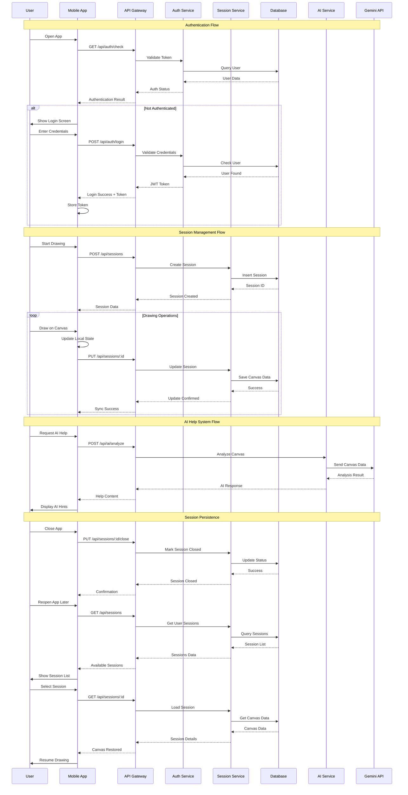
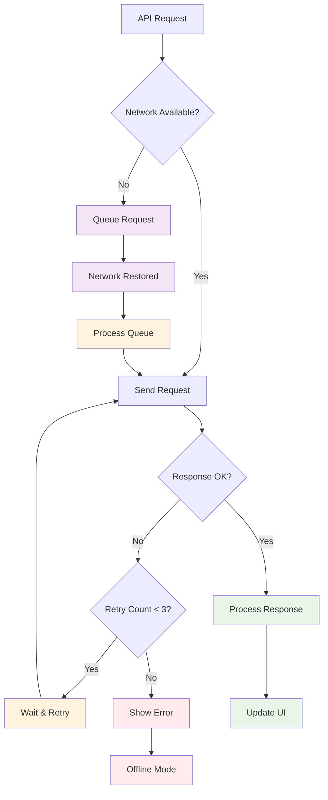

# API Interaction Flow Diagram

## API Interaction Patterns

### Authentication System
- **Token-based Authentication**: JWT tokens for secure API access
- **Session Validation**: Automatic token validation on app startup
- **Credential Management**: Secure storage of authentication tokens
- **Auto-refresh**: Token refresh mechanism for extended sessions

### Session Management
- **Session Creation**: New drawing sessions created on demand
- **Real-time Sync**: Canvas changes synchronized with backend
- **Session Persistence**: Automatic saving of drawing progress
- **Session Recovery**: Ability to restore previous sessions

### AI Integration
- **Context Analysis**: Canvas content sent to AI for analysis
- **Hint Generation**: AI provides contextual help and suggestions
- **Progressive Help**: Different levels of assistance based on user needs
- **Response Integration**: AI feedback seamlessly integrated into UI

### Error Handling & Retry Logic

### API Endpoints Summary

| Endpoint | Method | Purpose | Authentication |
|----------|--------|---------|----------------|
| `/api/auth/login` | POST | User authentication | No |
| `/api/auth/logout` | POST | End user session | Yes |
| `/api/auth/check` | GET | Validate token | Yes |
| `/api/sessions` | GET | List user sessions | Yes |
| `/api/sessions` | POST | Create new session | Yes |
| `/api/sessions/:id` | GET | Get session details | Yes |
| `/api/sessions/:id` | PUT | Update session | Yes |
| `/api/sessions/:id` | DELETE | Delete session | Yes |
| `/api/ai/analyze` | POST | AI canvas analysis | Yes |
| `/api/ai/hint` | POST | Generate AI hints | Yes |