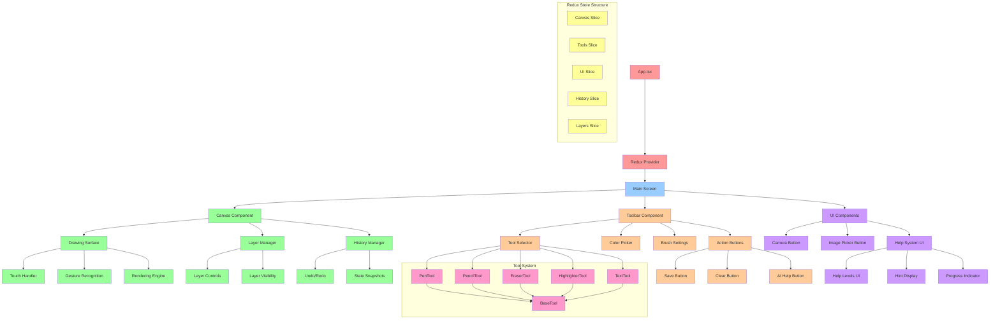

# Component Hierarchy Diagram

## Component Structure Overview

### Application Root
- **App.tsx**: Main application entry point with Redux Provider setup
- **Redux Provider**: State management wrapper for the entire application

### Main Screen Components
- **Canvas Component**: Core drawing functionality with touch handling and rendering
- **Toolbar Component**: Tool selection, settings, and action controls
- **UI Components**: Additional interface elements and help system

### Canvas System
- **Drawing Surface**: Main drawing area with touch and gesture recognition
- **Layer Manager**: Handles multiple drawing layers and visibility
- **History Manager**: Undo/redo functionality with state snapshots

### Toolbar System
- **Tool Selector**: Interface for choosing drawing tools
- **Color Picker**: Color selection for drawing tools
- **Brush Settings**: Size, opacity, and other tool properties
- **Action Buttons**: Save, clear, and AI help functionality

### Tool Architecture
- **BaseTool**: Abstract base class for all drawing tools
- **Specific Tools**: PenTool, PencilTool, EraserTool, HighlighterTool, TextTool
- Each tool inherits from BaseTool and implements specific drawing behavior

### State Management
- **Canvas Slice**: Drawing data, current canvas state
- **Tools Slice**: Active tool, tool settings, properties
- **UI Slice**: Interface state, modals, help system visibility
- **History Slice**: Undo/redo stack, state snapshots
- **Layers Slice**: Layer management, visibility, ordering