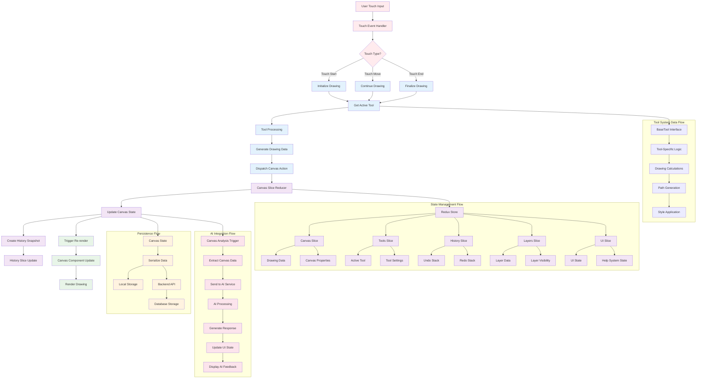

# Data Flow Diagram - Drawing Operations & State Management

## Data Flow Overview

### Drawing Operation Flow
1. **User Input**: Touch events captured from the drawing surface
2. **Event Processing**: Touch type determination (start, move, end)
3. **Tool Processing**: Active tool processes the input with specific logic
4. **State Update**: Canvas state updated through Redux actions
5. **History Management**: Automatic snapshot creation for undo/redo
6. **Re-rendering**: Canvas component updates to reflect new state

### State Management Architecture
- **Centralized Store**: Redux store manages all application state
- **Slice-based Organization**: Separate slices for different concerns
- **Immutable Updates**: State changes through reducers ensure predictability
- **Selector Pattern**: Efficient state access through selectors

### Tool System Data Processing
- **Unified Interface**: All tools implement BaseTool interface
- **Tool-Specific Logic**: Each tool handles input differently
- **Path Generation**: Mathematical calculations for drawing paths
- **Style Application**: Color, size, opacity applied to drawing data

### Persistence Strategy
- **Local Storage**: Immediate local persistence for offline capability
- **Backend Sync**: Periodic synchronization with server
- **Database Storage**: Permanent storage in MySQL database

### AI Integration Data Flow
- **Analysis Trigger**: User requests AI help or automatic analysis
- **Data Extraction**: Current canvas state serialized for AI processing
- **AI Processing**: Gemini 2.5 analyzes drawing and context
- **Response Integration**: AI feedback integrated into UI state
- **User Feedback**: Hints and suggestions displayed to user