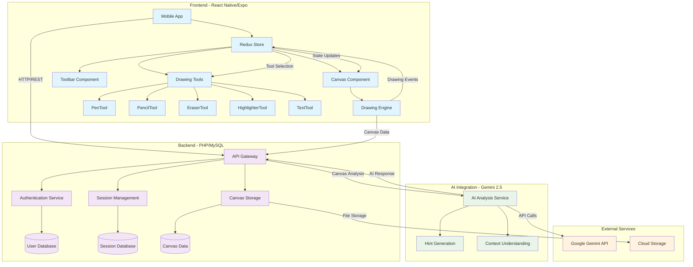

# System Architecture Diagram

## Architecture Overview

This diagram illustrates the complete system architecture of SL8.ai, showing the three main layers:

### Frontend Layer (React Native/Expo)
- **Mobile App**: Main application entry point
- **Redux Store**: Centralized state management
- **Canvas Component**: Main drawing surface
- **Drawing Tools**: Modular tool system (Pen, Pencil, Eraser, Highlighter, Text)
- **Drawing Engine**: Core drawing functionality

### Backend Layer (PHP/MySQL)
- **API Gateway**: RESTful API endpoints
- **Authentication Service**: User management and security
- **Session Management**: Canvas session persistence
- **Canvas Storage**: Drawing data storage and retrieval
- **Databases**: User, Session, and Canvas data storage

### AI Integration Layer (Gemini 2.5)
- **AI Analysis Service**: Canvas content analysis
- **Hint Generation**: Contextual help generation
- **Context Understanding**: Problem comprehension and guidance

### External Services
- **Google Gemini API**: AI processing capabilities
- **Cloud Storage**: File and media storage